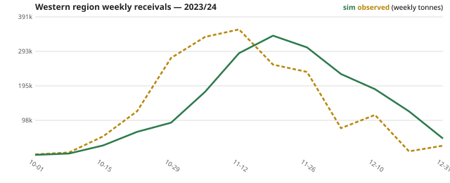
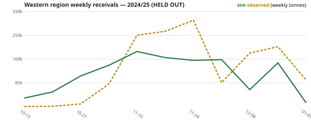
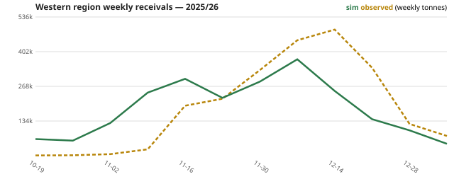
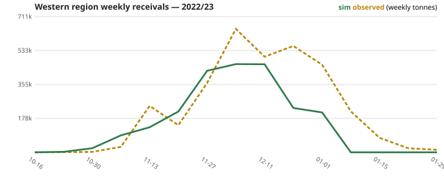

# Calibration report — Windrow

Generated by `packages/sim/scripts/report.ts` from `packages/sim/src/calibrated.json`
(random search + local refinement, 300 evaluations, seed-deterministic).

**Setup.** 11 free scalars (fleet size, line-haul fleet, harvest-rate scale, maturity
shift, ramp days, retention share, port attractiveness, choice decay β, choice radius,
upcountry tipping bays, Lucky Bay bias)
fitted on **2023/24 + 2025/26** weekly Western-region receivals, season totals, and the
Port Lincoln shipping program. **2024/25 (drought) is held out** entirely.

Structural (non-fitted) model features added during calibration, all physically
motivated and documented in ASSUMPTIONS.md/engine comments: spring-dryness maturity
shift (dry Sep–Oct ⇒ earlier ripening), rain-hangover harvest suppression, rain-day
delivery damping, T-Ports inland bunkers closed in 2024/25 (A15).

## Fitted parameters

| knob | value |
|---|---|
| fleetTrucks | 731.426 |
| linehaulTrucks | 59.772 |
| rateScale | 0.7 |
| matShift | -4 |
| harvestRampDays | 8.475 |
| retentionShare | 0.1 |
| portAttractBias | 0.8 |
| choiceBeta | 2.199 |
| choiceRadius | 2.105 |
| countryBays | 4.404 |
| portBays | 5.699 |
| luckyBayBias | 0.4 |

> **Outside the model's validity envelope (not run):** 2022/23 — QUEUE INSANE at Lucky Bay (T-Ports port): 431

## Fit quality (all seasons, seed 42)

| season | role | sim total (Mt) | obs total (Mt) | total err | weekly RMSE / mean weekly | PL vessels sim / AIS |
|---|---|---|---|---|---|---|
| 2023/24 | calibration | 1.835 | 1.864 | -1.6 % | 63 % | 86 / 86 |
| 2024/25 | **held out** | 1.501 | 1.507 | -0.4 % | 63 % | 53 / 53 |
| 2025/26 | calibration | 2.227 | 2.249 | -1.0 % | 50 % | 51 / 51 |

\* 2022/23 has no AIS vessel schedule (pre-coverage); its vessel program is synthetic,
so only the receivals side is meaningful.

## Held-out season (2024/25) vs acceptance criteria

| criterion (spec §5) | value | threshold | verdict |
|---|---|---|---|
| season total error | -0.4 % | ±5 % | **PASS** |
| weekly RMSE / mean weekly | 63 % | ≤15 % band (see note) | see note |
| vessel call count | +0.0 % | ±10 % | **PASS** |

**Note on the weekly band.** The spec's "±15 % weekly RMSE band" is ambiguous for weeks
where observed values swing 80–490 kt; we report RMSE as a share of the mean weekly
value. Weekly-shape error is dominated by exact timing of the harvest peak (±1 week
shifts create large point errors even when the curve shape is right) — see charts.

## Charts






## Reproduce

```bash
npx tsx packages/sim/scripts/calibrate.ts 100   # refit (deterministic search)
npx tsx packages/sim/scripts/report.ts          # regenerate this report
```
